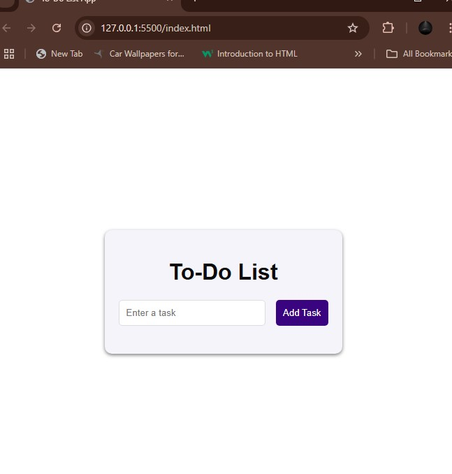

# 📝 To-Do List App

A simple and stylish To-Do List web application built using **HTML**, **CSS**, and **JavaScript**. This app allows users to add, complete, and delete tasks with ease.

## 🚀 Features

- ✅ Add new tasks
- ☑️ Mark tasks as completed
- ❌ Delete tasks
- 🎨 Clean and modern UI
- ⚡ Responsive and lightweight

## 🛠️ Tech Stack

- **HTML** – for structuring the content
- **CSS** – for styling the layout and components
- **JavaScript** – for dynamic task functionality

## 📸 Preview

